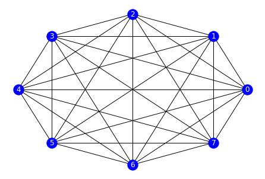

# The PC algorithm

## Identifying a network's causal structure

PC is a prototypical constraint-based algorithm that is used for identifying the edges of Bayesian networks. It contains two main steps:

1. identification of the graph's skeleton
2. orientation of edges

The end result is an equivalence class of DAGs.

## Implementation

### Import necessary libraries

For this task, the following libraries are needed. Special attention for `pingouin` and `networkx`, who are respectively helpful for resolving the statistical and network representation tasks of this problem.

``` python
from itertools import combinations

import matplotlib.pyplot as plt
import networkx as nx
import numpy as np
import numpy.linalg as la
import pandas as pd
import pingouin as pg
import scipy.io as sio

from scipy.stats import norm
```

### Loading data

For the input data, we will use data from an exercice given in MGT-416 at EPFL. It is a matrix formatted such that _columns_ represent the variables or **nodes** in the graph. As such, the _rows_ represent the samples. In this case, we have a `n = 10000` and `p = 8`.

``` python
data = sio.loadmat('/home/adhaene/Downloads/Data.mat')['D']
n, p = data.shape
```

### Initialisation of the complete undirected graph

The PC Algorithm starts of with a fully connected undirected graph. The goal is then to remove edges between nodes that are uncorrelated.

Using the `networkx` library, we can do as follows

``` python
graph = nx.complete_graph(p)
```

To have a visual representation of what we've just done, we can use the following lines. The first creates a lambda function for plotting graphs, the second calls this function.

``` python
draw = lambda x: nx.draw_circular(x, with_labels=True, node_color='b', font_color='w')
draw(graph)
```



A complete graph with 8 nodes can be observed.

### Edge deletion
