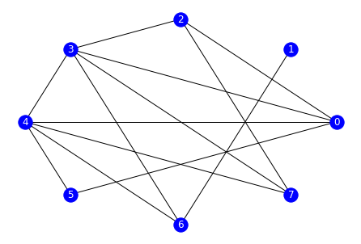
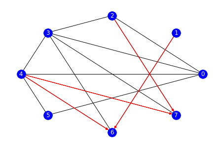
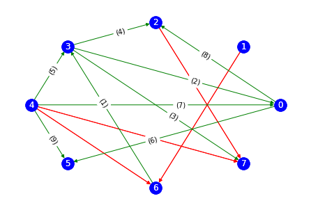

# The PC algorithm

<!-- TOC depthFrom:2 depthTo:4 withLinks:1 updateOnSave:1 orderedList:0 -->

- [Identifying a network's causal structure](#identifying-a-networks-causal-structure)
- [Implementation](#implementation)
	- [Import necessary libraries](#import-necessary-libraries)
	- [Loading data](#loading-data)
	- [Initialisation of the complete undirected graph](#initialisation-of-the-complete-undirected-graph)
	- [Edge deletion](#edge-deletion)
	- [Orientation of V-structures](#orientation-of-v-structures)
	- [[Extra] Edge orientation using Meek Rules](#extra-edge-orientation-using-meek-rules)
- [References](#references)

<!-- /TOC -->

## Identifying a network's causal structure

PC is a prototypical constraint-based algorithm that is used for identifying the edges of Bayesian networks. It contains two main steps:

1. identification of the graph's skeleton
2. orientation of edges

The end result is an equivalence class of DAGs.

## Implementation

### Import necessary libraries

For this task, the following libraries are needed. Special attention for `pingouin` and `networkx`, who are respectively helpful for resolving the statistical and network representation tasks of this problem.

``` python
from itertools import combinations

import matplotlib.pyplot as plt
import networkx as nx
import numpy as np
import numpy.linalg as la
import pandas as pd
import pingouin as pg
import scipy.io as sio

from scipy.stats import norm
```

### Loading data

For the input data, we will use data from an exercice given in MGT-416 at EPFL. It is a matrix formatted such that _columns_ represent the variables or **nodes** in the graph. As such, the _rows_ represent the samples. In this case, we have a `n = 10000` and `p = 8`.

``` python
data = sio.loadmat('/home/adhaene/Downloads/Data.mat')['D']
n, p = data.shape
```

### Initialisation of the complete undirected graph

The PC Algorithm starts of with a fully connected undirected graph. The goal is then to remove edges between nodes that are uncorrelated.

Using the `networkx` library, we can do as follows

``` python
graph = nx.complete_graph(p)
```

To have a visual representation of what we've just done, we can use the following lines. The first creates a lambda function for plotting graphs, the second calls this function.

``` python
draw = lambda x: nx.draw_circular(x, with_labels=True, node_color='b', font_color='w')
draw(graph)
```


A complete graph with 8 nodes can be observed.

### Edge deletion

For this step, we will delete all edges for which the partial correlation is too low. We will start by checking the partial correlation of node X with Y by controlling no nodes. We then iteratively add nodes to the controlling set Z. If and when the edge is deleted, we will save set Z as the _separating set_.

It is now necessary to define the threshold function which will be used to test if the partial correlation between pairwise variables is zero. For this example, we will use the following formula

𝜏(𝑆) = Φ(1−𝛼/2)−1/√(𝑛−|𝑆|-3)

where  Φ(⋅)  denotes the cumulative distribution function of N(0, 1) . For this example, we will use  𝛼 = 0.05.

```python
 # Using `norm` from the scipy stats package
phi_inv = lambda x: norm.ppf( norm.cdf(x) )
alpha = 0.05

 # Defining the threshold function
threshold = lambda x: phi_inv(1 - alpha/2) / np.sqrt(n - x - 3)
```

Using the partial correlation method defined in the Pingouin library, we can calculate the partial correlation (Pearson) between pairwise variables, controlling on a specified number of the remaining variables in the dataset.

To do so, we must first turn the dataset into a Pandas DataFrame. We can then do a greedy search to check all neighbors of all nodes.

```python
def phi(df, X, Y, Z=None):
    """
    Get partial correlation between X and Y controlling on set Z

    :param X: index of variable X
    :param Y: index of variable Y
    :param Z: index/indices of controlling variable(s)
    :return phi: partial correlation (Pearson)
    """
    if type(Z) is int:
        Z = str(Z)
    elif Z is not None:
        Z = [str(e) for e in Z]

    return float(df.partial_corr(x=str(X), y=str(Y), covar=Z)['r'])
```

Having defined the above function, we now get to the most important part of the PC Algorithm—which I've defined in a single function.

``` python
 # Used to break out of the loop in a highly specific manner
class RemoveEdge(Exception): pass

def pc(data, verbose=False):
    """
    Run PC Algorithm.

    :param data: raw data N x P (samples x nodes)
    :return A: adjacency matrix
    :return separators: separating sets
    """

    graph = nx.complete_graph(p)
    df = pd.DataFrame(data=data, columns=[str(e) for e in list(range(p))])

    # initialize separators list
    separators = np.empty((p, p), dtype=list)

    # loop over degree of test
    for deg in range(p - 2):

        if verbose >= 1:
                print('\n----- ' + 'Performing {}-degree tests\n'.format(deg))

        for x in graph.nodes:

            if verbose == 2:
                print('\n=== ' + 'Checking node {}\n'.format(x))

            remove = []

            for y in graph.neighbors(x):
                try:

                    z = list(graph.neighbors(x))
                    z.remove(y)

                    if len(z) >= deg:

                        for zz in combinations(z, deg):

                            if verbose == 2:
                                print('{} ind. {} with z: {}'.format(x, y, ", ".join([str(e) for e in zz])))

                            if np.abs(phi(df, x, y, zz)) < threshold(p - 2 - len(zz)):

                                if verbose >= 1:
                                    print('{0} ind. {1} | {2}'.format(x, y, zz))

                                remove.append(y)

                                separators[x, y] = zz

                                raise RemoveEdge()

                except RemoveEdge:
                    pass

            for nei in remove:
                if (x, nei) in graph.edges:
                    graph.remove_edge(x, nei)

    return graph, separators
```

For this particular example, I would use the following line

``` python
G, separators = pc(data, verbose=1)
```

which would output the following

```
----- Performing 0-degree tests

0 ind. 1 | ()
1 ind. 2 | ()
1 ind. 4 | ()
1 ind. 5 | ()
1 ind. 7 | ()

----- Performing 1-degree tests

0 ind. 6 | (4,)
2 ind. 6 | (4,)
3 ind. 5 | (4,)
5 ind. 6 | (4,)
6 ind. 7 | (4,)

----- Performing 2-degree tests

2 ind. 4 | (0, 3)
2 ind. 5 | (0, 3)
3 ind. 1 | (4, 6)
7 ind. 5 | (2, 4)

----- Performing 3-degree tests

0 ind. 7 | (2, 3, 4)

----- Performing 4-degree tests


----- Performing 5-degree tests
```

With this output, the separating sets can be identified. Additionally, these are available in the `separators` variable as follows

```
array([[None, (), None, None, None, None, (4,), (2, 3, 4)],
       [None, None, (), None, (), (), None, ()],
       [None, None, None, None, (0, 3), (0, 3), (4,), None],
       [None, (4, 6), None, None, None, (4,), None, None],
       [None, None, None, None, None, None, None, None],
       [None, None, None, None, None, None, (4,), None],
       [None, None, None, None, None, None, None, (4,)],
       [None, None, None, None, None, (2, 4), None, None]], dtype=object)
```

We can then display the graph as follows

``` python
A = nx.to_numpy_matrix(G)
draw(G)
```



### Orientation of V-structures

The next task is to identify all colliders. To do so, we'll define three different functions:

* `add_collider` which adds a collider to the adjancency matrix
* `is_collider` which evaluates a specific three-node group and determines whether or not X —> Z <— Y
* `get_colliders` which checks all nodes in a graph for v-structures

``` python
def add_collider(A, X, Y, Z, verbose=False):
    """
    Add collider Z between X and Y to ajacency matrix A.
    We have X independent of Y conditioned on nothing, but
    X dependent of Y conditioned on Z.

    :param A: adjancency matrix
    :param X: index of variable X
    :param Y: index of variable Y
    :param Z: index of variabll Z
    :return B: updated adjancency matrix
    """

    if verbose:
        print('\n Adding collider: {0} -> {2} <- {1} \n'.format(X, Y, Z))

    B = np.asarray(A.copy())

    B[X, Z] = 1
    B[Y, Z] = 1
    B[Z, X] = 0
    B[Z, Y] = 0

    return B
```

``` python
def is_collider(df, X, Y, Z, p, separators, verbose=False):
    """
    Check in data if X -> Z <- Y

    :param df: raw data as pandas DataFrame
    :param X: index of variable X
    :param Y: index of variable Y
    :param Z: index of variable Z
    :param p: total number of variables
    :param separators: separator matrix from step 1 of the PC Algorithm
    :return is_collider: boolean
    """
    # should never go to else unless separators is None for X, Y
    sep = separators[Y, X] if separators[X, Y] is None else separators[X, Y]

    # Z is not a collider if it is a part of the separating set
    if Z in sep:
        return False

    # create new subset of separating set S + Z
    ss = [str(e) for e in sep]
    ss_z = ss + [str(Z)]

    # check on independence with ('w') and without ('wo') Z in conditioning set
    wo = float(df.partial_corr(x=str(X), y=str(Y), covar=ss)['r'])
    w = float(df.partial_corr(x=str(X), y=str(Y), covar=ss_z)['r'])

    if verbose:
        print('Checking collider: {0} -> {2} <- {1} with sep: {5}, wo {3} w {4}'.format(X, Y, Z, round(wo, 4), round(w, 4), sep))

    return np.abs(wo) < threshold(p - 2) and np.abs(w) > threshold(p - 3)
```

``` python
def get_colliders(A, data, separators, verbose=False):
    """
    Get colliders in graph A using raw data. The implementation
    is greedy and two-way but wit a small sample size it's fine.

    :param A: adjancency matrix
    :param data: raw data
    :param separators: separator matrix from step 1 of the PC Algorithm
    :return colliders: list of triple-tuples
    """
    graph = nx.from_numpy_matrix(np.asarray(A), create_using=nx.Graph)

    p = np.asarray(A).shape[0]
    df = pd.DataFrame(data=data, columns=[str(e) for e in list(range(p))])

    # initialize edges
    edges = []

    for x in graph.nodes:
        for z in graph.neighbors(x):
            for y in graph.neighbors(z):

                if y == x or y in graph.neighbors(x):
                    continue

                if is_collider(df, x, y, z, p, separators, verbose):
                    edges.append( (x, z,) )
                    edges.append( (y, z,) )
                    A = add_collider(A, x, y, z, verbose)

    return A, edges
```

Running the code gives the following results for our example dataset. We used a more specific call to `nx.draw_circular` for a nice output of directed versus undirected edges.

``` python
B, v_edges = get_colliders(A, data, separators, verbose=True)
gr = nx.from_numpy_array(B, create_using=nx.DiGraph)

nx.draw_circular(gr.to_undirected())
nx.draw_circular(gr, edgelist=v_edges, edge_color='red', with_labels=True, node_color='b', font_color='w')
```



In particular, we identify two different colliders: (4 —> 6 <— 1) and (2 —> 7 <— 4).

### [Extra] Edge orientation using Meek Rules

To begin, let's explicit the Meek rules:

1. Unshielded collider rule
2. Acyclicity rule
3. Hybrid rule

For this particular example, these are the edge direction that can be identified:

* According to rule #1: 1 —> 6 — 3 becomes 1 —> 6 —> 3
* According to rule #1: 6 —> 3 — 0 becomes 6 —> 3 —> 0
* According to rule #1: 6 —> 3 — 7 becomes 6 —> 3 —> 7
* According to rule #1: 6 —> 3 — 2 becomes 6 —> 3 —> 2
* According to rule #2: 4 — 3 becomes 4 —> 3 to avoid cycle 4 —> 6 —> 3 —> 4
* According to rule #1: 3 —> 0 — 5 becomes 3 —> 0 —> 5
* According to rule #2: 4 — 0 becomes 4 —> 0 to avoid cycle 4 —> 0 —> 3 —> 4
* According to rule #1: 4 —> 0 — 2 becomes 4 —> 0 —> 2
* According to rule #2: 4 — 5 becomes 4 —> 5 to avoid cycle 4 —> 0 —> 5 —> 4

While it is not done in this particular example, the Meek Rules could also be defined programatically.

We get the following graph as a result

``` python
meek_edges = [(6, 3,), (3, 0,), (3, 7,), (3, 2,), (4, 3,), (0, 5,), (4, 0,), (0, 2,), (4, 5,)]
labels = dict(zip(meek_edges, ['({})'.format(i) for i in range(1, 10)]))

nx.draw_circular(gr, edgelist=v_edges, edge_color='red', with_labels=True, node_color='b', font_color='w')
nx.draw_networkx_edge_labels(gr, pos=nx.circular_layout(gr), edge_labels=labels, label_pos=0.4)
nx.draw_circular(gr, edgelist=meek_edges, edge_color='green', with_labels=True, node_color='b', font_color='w')
```



## References

* <a href="http://www.stat.cmu.edu/~larry/=sml/DAGs.pdf" target="_blank"> Lafferty, J., Liu, H., Wasserman, L., 2010. Directed Graphical Models. </a>
* <a href="https://www.stat.cmu.edu/~cshalizi/uADA/12/lectures/ch25.pdf" target="_blank">Shalizi, C., 2012. Discovering Causal Structure from Observations.</a>
